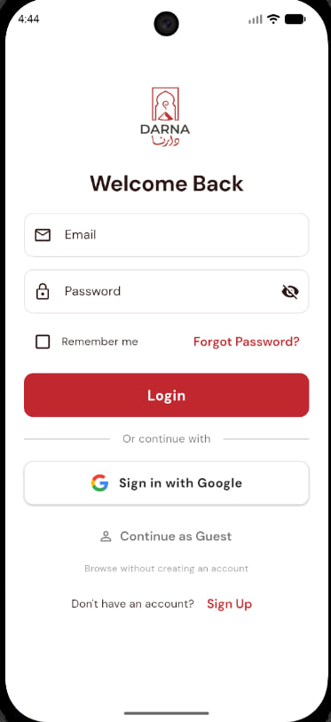
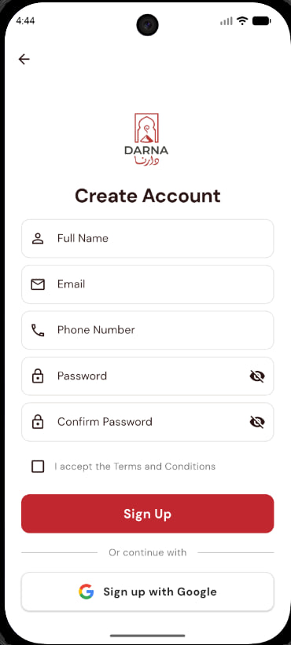
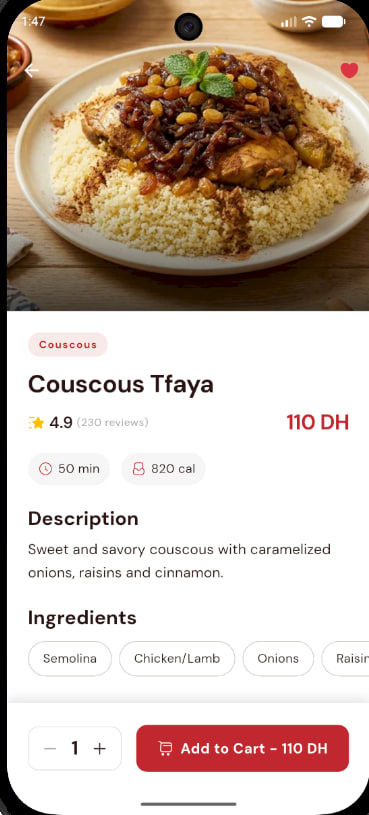
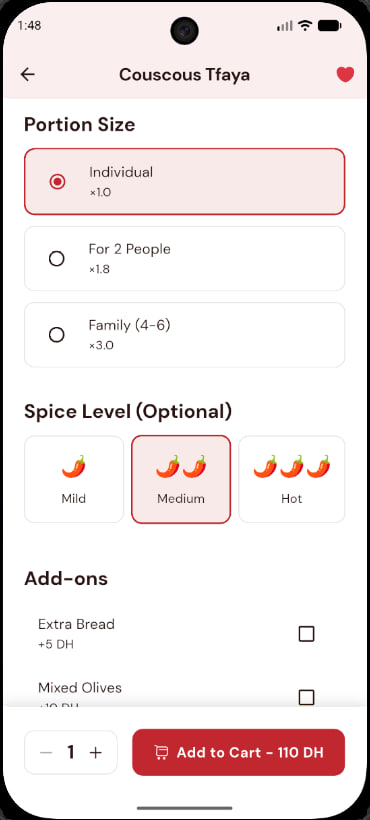
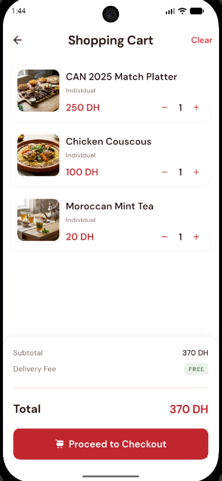
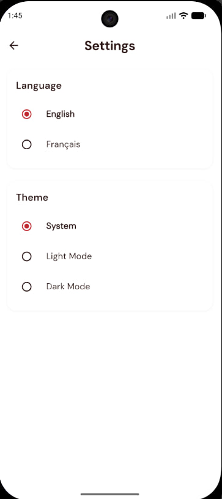
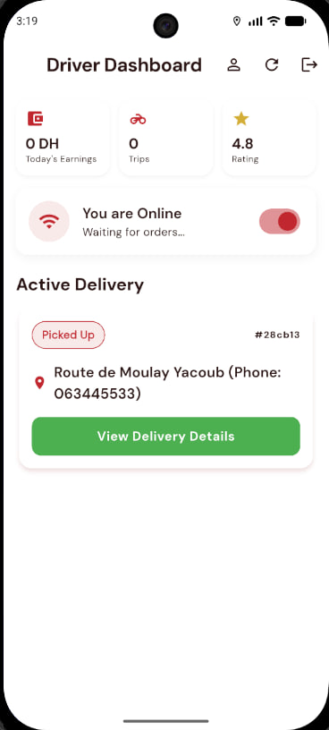
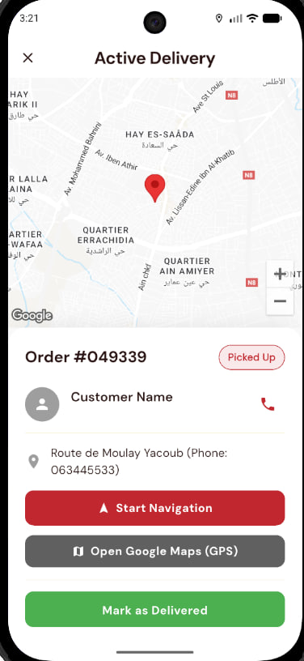
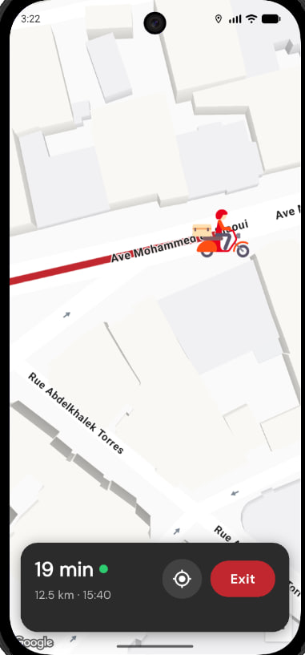

<div align="center">


# 🍽️ Darna - Premium Moroccan Restaurant App

*Bringing authentic Moroccan cuisine to your doorstep*

[](https://flutter.dev)
[](https://firebase.google.com)
[](LICENSE)

[Features](#-features) • [Screenshots](#-screenshots) • [Tech Stack](#-tech-stack) • [Getting Started](#-getting-started) • [Architecture](#-architecture) • [Team](#-team)

</div>

---

## 📱 About

**Darna** is a premium Flutter-based mobile application for a Moroccan restaurant, offering a seamless food ordering and delivery experience. Built with modern architecture and Firebase backend, it provides features for customers, delivery drivers, and restaurant administrators.

## ✨ Features

### 🎯 For Customers
- 🏠 **Browse Premium Menu** - Explore authentic Moroccan dishes with stunning visuals
- 🛒 **Smart Cart** - Easy add-to-cart with customization options
- 📍 **Google Maps Integration** - Real-time delivery tracking
- 💳 **Multiple Payment Options** - Cash on delivery, card payments
- ❤️ **Favorites** - Save your favorite dishes
- 🌍 **Multi-Language** - French & English support
- 🎨 **Dark Mode** - Premium UI with light/dark themes

### 🚚 For Drivers
- 📦 **Order Management** - Accept and manage delivery orders
- 🗺️ **GPS Navigation** - Built-in Google Maps navigation
- 💰 **Earnings Tracker** - Monitor delivery earnings
- ⚡ **Real-time Updates** - Live order status sync

### 👨‍💼 For Admins
- 📊 **Dashboard** - Comprehensive business analytics
- 🍕 **Menu Management** - Add, edit, delete products
- 👥 **Driver Assignment** - Assign orders to drivers
- 📈 **Sales Reports** - Track revenue and performance
- 🎛️ **Order Control** - Manage all orders in real-time

## 📸 Screenshots

<div align="center">

| Home Screen | Login | Sign Up |
|:---:|:---:|:---:|
|  |  |  |

| Product Details | Customization | AI Chatbot Assistant |
|:---:|:---:|:---:|
|  |  |  |

| Shopping Cart | Favorites | Profile |
|:---:|:---:|:---:|
|  |  |  |

| Settings | Driver Dashboard | Driver Orders |
|:---:|:---:|:---:|
|  |  |  |

| Driver Navigation | Admin Dashboard | Admin Products |
|:---:|:---:|:---:|
|  |  |  |

| Admin Driver Management | Admin Add Product | |
|:---:|:---:|:---:|
|  |  | |

</div>

## 🛠️ Tech Stack

### Frontend
- **Flutter** 3.24.5 - Cross-platform framework
- **Riverpod** - State management
- **Go Router** - Navigation
- **Flutter Animate** - Smooth animations
- **Shimmer** - Loading effects

### Backend & Services
- **Firebase Authentication** - User auth
- **Cloud Firestore** - NoSQL database
- **Firebase Storage** - Image storage
- **Google Maps API** - Location services
- **Geolocator** - GPS tracking

### Architecture
- **Clean Architecture** - Separation of concerns
-  **Repository Pattern** - Data abstraction
- **Provider Pattern** - Dependency injection
- **MVVM** - Presentation layer

## 🚀 Getting Started

### Prerequisites

- Flutter SDK (3.24.5 or higher)
- Firebase account
- Google Maps API key
- Android Studio / VS Code
- Git

### Installation

1. **Clone the repository**
   ```bash
   git clone https://github.com/YOUR_USERNAME/darna-restaurant-app.git
   cd darna-restaurant-app
   ```

2. **Install dependencies**
   ```bash
   flutter pub get
   ```

3. **Firebase Setup**
   
   a. Create a new Firebase project at [Firebase Console](https://console.firebase.google.com)
   
   b. Enable the following services:
   - Authentication (Email/Password)
   - Cloud Firestore
   - Firebase Storage
   
   c. Download `google-services.json` (Android) and place it in `android/app/`
   
   d. Download `GoogleService-Info.plist` (iOS) and place it in `ios/Runner/`
   
   e. Run FlutterFire CLI to configure:
   ```bash
   flutterfire configure
   ```

4. **Google Maps Setup**
   
   Add your API key to `android/app/src/main/AndroidManifest.xml`:
   ```xml
   <meta-data
       android:name="com.google.android.geo.API_KEY"
       android:value="YOUR_GOOGLE_MAPS_API_KEY"/>
   ```

5. **Firestore Security Rules**
   
   Copy and publish rules from `firebase.json` to your Firebase Console

6. **Run the app**
   ```bash
   flutter run
   ```

## 📐 Project Structure

```
lib/
├── core/                   # Core utilities & shared code
│   ├── constants/         # App constants
│   ├── theme/             # Theme configuration
│   ├── widgets/           # Reusable widgets
│   ├── services/          # Core services
│   └── router/            # App routing
├── features/              # Feature modules
│   ├── auth/             # Authentication
│   ├── home/             # Home screen
│   ├── product/          # Product catalog
│   ├── cart/             # Shopping cart
│   ├── order/            # Order management
│   ├── delivery/         # Driver features
│   ├── admin/            # Admin dashboard
│   └── profile/          # User profile
└── main.dart             # Entry point
```

## 🔒 Security

- API keys are **NOT** included in this repository
- Use `.env` file for sensitive data (see `.env.example`)
- Firebase Security Rules enforce role-based access
- Image uploads are validated and compressed

## 🧪 Testing

To run tests:
```bash
flutter test
```

## 📦 Building

### Android APK
```bash
flutter build apk --release
```

### iOS IPA
```bash
flutter build ios --release
```

## 👥 Team

This project was developed by:

- **Salah Eddine Hajjioui** 
- **Ahmed Nour El Bourkadi**
- **Hend Ait Temghart**

## 📄 License

This project is licensed under the MIT License - see the [LICENSE](LICENSE) file for details.


## 📞 Support

For support or questions, please open an issue in the GitHub repository.

---

<div align="center">

**Made with ❤️ and Flutter**

⭐ Star this repo if you find it helpful!

</div>
